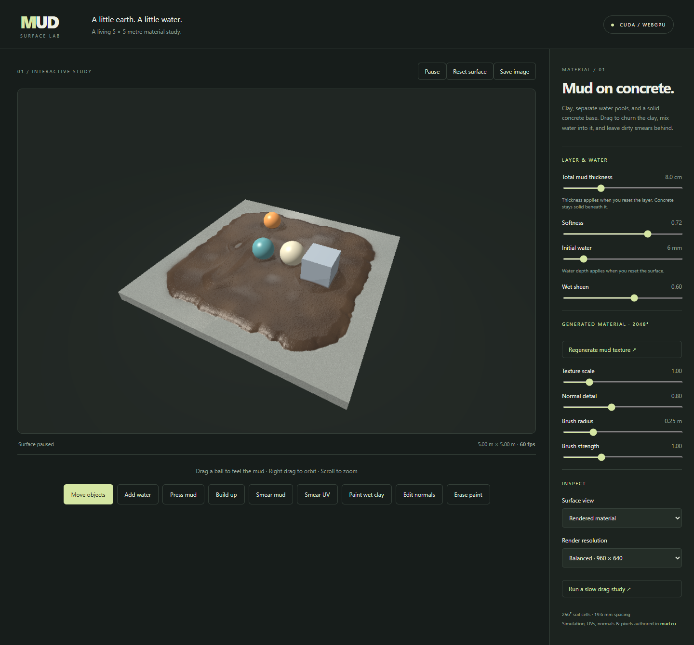

# Mud on concrete

[Live demo](https://samg-coder.github.io/Mud/) | [Source](https://github.com/SamG-Coder/Mud) | [Build and deployment](https://github.com/SamG-Coder/Mud/actions/workflows/pages.yml)



A finite wet mud layer on a **5 x 5 metre concrete block**. Simulation, texture generation, UV transport, normal editing, material transport, object dynamics, lighting and rendering are authored in [src/mud.cu](src/mud.cu), using CUDA WebShader.

## Run

```powershell
cd D:\Mud
npm install
npm run build
npm start
```

Open **http://127.0.0.1:4325** in WebGPU-capable Edge or Chrome. The compiler/runtime is vendored, and scene materials are generated locally. The CUDA C subset compiles to WGSL for browser execution.

## Layer and controls

**Total mud thickness** sets the initial layer in centimetres, from **0.5 to 25 cm**, default **8 cm**. Press **Reset surface** to apply it. This controls actual initial mud volume. Thickness is nominal within the deposit, with procedural variation and an irregular tapered perimeter. The rigid concrete top is fixed at zero; the block is 22 cm deep. The concrete occupies the complete square, while the initial mud has rounded, irregular edges.

- **Move objects:** left-drag a ball or the block. Contact pressure displaces mud, and tangential motion pushes it into smears and piles. A damped grab spring and release damping provide resistance.
- **Smear mud:** drag over the layer to transport solid material sideways.
- **Add water:** inject water. **Press mud / Build up:** remove or add mud; pressing can expose concrete.
- **Smear UV:** drag to pull material coordinates in the stroke direction independently. UV, clay paint and normal tools remain active while simulation is paused.
- **Paint wet clay / Edit normals / Erase paint:** edit the material map. Painted clay and edited normals travel with the mud.
- **Regenerate mud texture:** generates a new **2048 x 2048** atlas in `.cu`, without resetting the deformation or moving objects.
- Adjust softness, sheen, texture scale, normal detail and brush controls live. Initial water applies on reset.
- Right-drag or Alt-drag to orbit; scroll to zoom.
- Inspect height/water, normal, UV, moisture/pool/sediment and residue/mixing views; choose render resolution independently of simulation resolution.
- **Run a slow drag study** demonstrates contact. **Save image** downloads a PNG.

## Model

The simulation has 256 x 256 cells at approximately 19.6 mm spacing and fixed 1/120-second substeps. Each cell carries finite mud thickness above concrete, free water depth and transported UVs. Separate fields track absorbed pore water, suspended clay, kneading history and transported clay pigment. A stationary concrete map stores deposited sediment, wetness and smear history. A separate map carries painted tint, roughness change and editable tangent-normal offsets.

Mud transport uses a Herschel-Bulkley-inspired shallow-layer flow law with a moisture- and structure-dependent yield threshold. Advected clay structure weakens under shear and recovers at rest, separately from permanent kneading and pigment mixing. Tangential object and brush motion also pushes material. Donor limiting prevents a cell from sending more mud than it holds. Outgoing material enters neighbouring cells, creating banks and smears. UVs and painted material travel with the same solid mass flux. Free water has a separate conservative flux, closed boundaries, contact expulsion and gravity leveling. It starts in uneven pockets rather than as a uniform coating. Absorption is slow at rest and speeds up under stirring; moving bodies and the smear brush lift clay into suspension. Suspended clay travels with water and settles. Mud motion leaves a thin adhered residue that remains when the bulk layer moves away. Total water includes free and absorbed water; total solids include bulk mud, suspended sediment and adhered residue. Brushes intentionally add or remove material.

The generated atlas contains albedo variation, micro-height, roughness and silt variation. Transport blends clay pigment, and kneading softens the original surface detail. Pore moisture darkens clay independently of free water: clearer pools preserve their underlying surface, while suspended clay makes water brown and opaque. Residue darkens exposed concrete and retains wetness after a smear. It uses domain-warped procedural detail at multiple scales, with folds and pores. CUDA samples it through the transported UVs and derives normals from micro-height and geometry, using the transported UV Jacobian so stretch and rotation change texture normals consistently, then adding painted normals and moving-contact ripple normals. Concrete has separate rigid box geometry and a procedural aggregate material.

Objects use GPU ping-pong integration, collider-intrusion pressure and overdamped vertical support, and stop on the concrete. Three analytic spheres and an axis-aligned block are supported. The block has a square mud-pressure footprint; inter-object collision uses a spherical approximation. Angular dynamics, arbitrary mesh collisions, volumetric splashes and mud strings are outside this surface model. Water and soil use a layered height-field approximation, not a volumetric multiphase fluid solver. Parameters are artistic rather than calibrated to a measured soil sample. [Research and implementation rationale](docs/mud-rheology.md) documents the sources, assumptions and omitted behavior.

The host handles input, dispatch and presentation. GPU pixels copy directly to the WebGPU canvas. The normal display loop does not download fields or images; picking reads only the small object buffer. Pipelines and bindings are reused.

## Validation

Run **npm test**. It starts the local server if needed and uses headless Edge with WebGPU. Checks cover finite stable fields, mud/water conservation, concrete support, contact clearing, persistent deformation, UV transport, paint/normal editing, actual canvas mouse picking and dragging, and the smear brush. It compares 1 cm and 20 cm layer volumes and verifies that texture regeneration changes the material without changing geometry. Identical water patches are compared at rest and while stirring, checking increased kneading and suspended sediment. Cleared concrete must retain residue after settling. Actual pointer strokes while paused must change UVs and tangent normals, change the rendered normal view, and preserve soil and water geometry. Structure must weaken under churning and recover at rest; stationary thick-layer contacts must avoid rebound.

For the repeated up/down path test, keep the server running and run **node scripts/contact-study.mjs**. It drags a sphere through four reversing passes, checks conservation and concrete support, then verifies the track remains after five seconds of settling.

Evidence is in **artifacts/validation.json** and **artifacts/mud-*.png**, including thin/thick layers and concrete/smearing previews. The benchmark measures active simulation at all three render resolutions and during dragging. Timing is host/GPU queue completion, not isolated kernel timestamps. The report records the adapter and exact measurements. Earlier desktop browser automation had a lower presentation cadence than headless Edge; the automated frame rate is not a guarantee of foreground desktop FPS.

## GitHub Pages

Pushes to `main` and manual workflow runs compile the thirteen CUDA WebShader kernels, check JavaScript syntax and the dependency lock, and deploy a static site to GitHub Pages. Pull requests run the build without deploying. The package contains the browser module dependency tree, generated kernels, CUDA source, research notes and upstream license. Relative asset paths support the `/Mud/` project URL.

Run `npm run check` and `npm run pages` locally to create `dist/`. GitHub Actions builds the browser shaders through the JavaScript compiler; native CUDA and hardware GPU validation run locally. WebGPU support and a compatible browser/GPU are required for the live simulation.

## Source

- [src/mud.cu](src/mud.cu): thirteen simulation, material generation/editing/transport and rendering kernels.
- [src/main.js](src/main.js): browser host and controls.
- [scripts/build.mjs](scripts/build.mjs): CUDA WebShader compilation.
- [scripts/test.mjs](scripts/test.mjs): browser validation and evidence.
- [vendor/cuda-webshader](vendor/cuda-webshader): copied from D:\cuda-webshader, local HEAD ef46ff1bf02a306bad94ddc18286d25d3d902c14; upstream MIT license retained.

Rebuild after editing `.cu` and reload. Generated artifacts are included in generated/.
